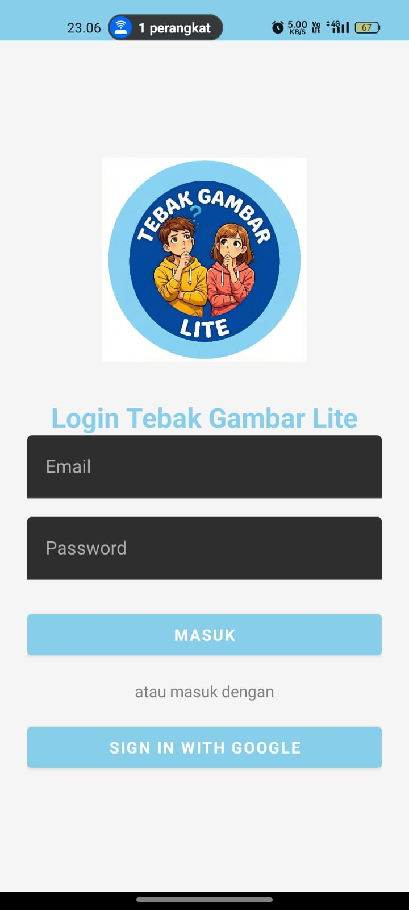
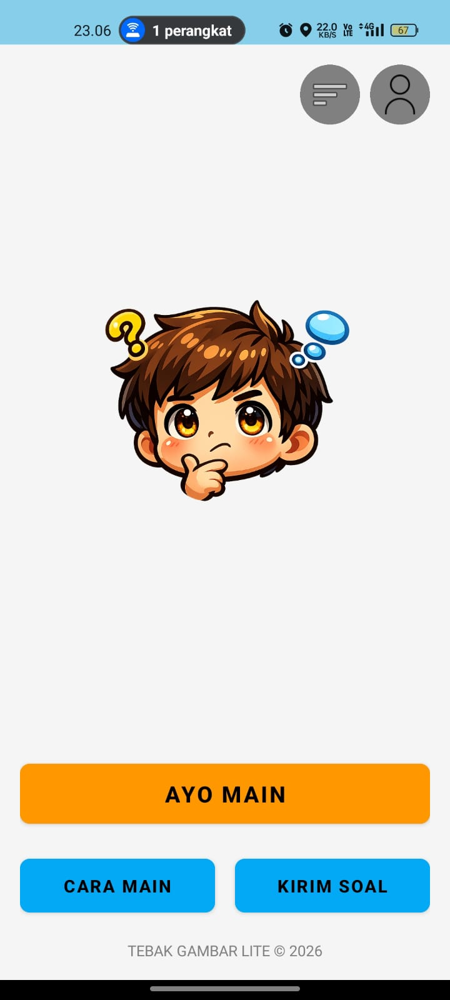

# Tebak Gambar Lite - UAS Mobile 2

Aplikasi game tebak gambar berbasis Android Kotlin yang dirancang sebagai game asah otak sederhana, di mana pemain harus menebak rangkaian kata dari dua gambar yang ditampilkan. Aplikasi ini dilengkapi dengan sistem progresi level dan fitur kontribusi soal dari pemain.

Proyek ini dikembangkan untuk memenuhi Tugas Besar / Ujian Akhir Semester (UAS) Mata Kuliah Aplikasi Mobile 2.

## 👤 Identitas Pengembang
* **Nama 1:** [Muh. Izmul Muflih] ([2304411380]) | [5K RPL 3]
* **Nama 2:** [Winda Niurwanti] ([2304411794]) | [5K RPL 3]
* **Prodi:** Informatika - Universitas Cokroaminoto Palopo
* **Tahun:** 2024

## 📱 Deskripsi Aplikasi
* **Nama Aplikasi:** Tebak Gambar Lite
* **Aplikasi Rujukan:** [Tebak Gambar (Official)](https://play.google.com/store/apps/details?id=com.id.application.tebakgambar)
* **Tebak Gambar Lite** adalah versi sederhana dari game populer "Tebak Gambar". Pemain akan memilih level, kemudian menyelesaikan 10 soal di setiap levelnya. Aplikasi ini memiliki fitur unik di mana **pemain (user)** dapat berpartisipasi dengan mengirimkan usulan soal mereka sendiri, yang kemudian akan direview dan ditambahkan ke dalam game oleh **admin**.

## 🛠️ Teknologi & Tools
* **Bahasa:** Kotlin
* **IDE:** Android Studio
* **Database:** Firebase Realtime Database
* **Otentikasi:** Firebase Authentication (Email & Password, Google Sign-In)
* **Penyimpanan Gambar:** Konversi ke **Base64** dan disimpan sebagai teks di Realtime Database.
* **Minimum SDK:** Android 7.0 (Nougat)

## ✅ Fitur & Checklist Ujian (CRUD + Fragment)
Aplikasi ini telah memenuhi kriteria kelulusan UAS:

### 1. Otentikasi User (Firebase Auth)
- ✔️ **Login & Register** aman menggunakan Email & Password.
- ✔️ **Auto-login** (sesi tersimpan) sehingga user tidak perlu login berulang kali.
- ✔️ Terdapat dua peran (role) implisit: **User/Pemain** dan **Admin**.

### 2. Database & CRUD (Create, Read, Update, Delete)
- ✔️ **Create (Input):**
    - **Admin:** Menambahkan soal baru secara spesifik ke **Level** dan **Nomor Soal (1-10)**.
    - **User:** Mengirim usulan soal (gambar + jawaban) ke "kotak masuk" untuk direview admin.
- ✔️ **Read (Tampil):**
    - Menampilkan daftar level yang terkunci dan terbuka.
    - Menampilkan grid 10 soal di setiap level, dengan sistem gembok untuk soal yang belum bisa dimainkan.
    - Memuat gambar dan jawaban soal dari database.
- ✔️ **Update (Edit):**
    - **Admin:** Bisa mereview dan "mempromosikan" soal dari user ke dalam level permainan.
    - **User:** Progres level (soal yang sudah terbuka) tersimpan di database dan diperbarui setiap kali berhasil menjawab.
- ✔️ **Delete (Hapus):**
    - **Admin:** Bisa menolak dan menghapus usulan soal dari user.

### 3. Komponen Android
- ✔️ **Intent:** Perpindahan antar semua halaman (Splash -> Login -> Main Menu -> Level -> Game).
- ✔️ **RecyclerView:** Digunakan untuk menampilkan daftar level dan grid 10 soal.
- ✔️ **UI/UX:** Tampilan yang bersih dan fungsional, dengan sistem progres yang jelas (gembok terkunci/terbuka).

## 📸 Screenshots
Berikut adalah dokumentasi tampilan aplikasi:

| Halaman Login | Dashboard Utama | Tampilan Semua Level |
|:---:|:---:|:---:|
|  |  |  |
| *(Halaman login user)* | *(Menu utama aplikasi)* | *(Progres level yang terbuka)* |

| Tampilan Level | Kiriman Soal (User) | Panel Admin |
|:---:|:---:|:---:|
|  |  |  |
| *(Grid soal dengan gembok)* | *(Form untuk user mengirim soal)* | *(Form admin untuk mengisi slot soal)* |

*(Catatan: Semua gambar tersimpan di folder 'screenshots')*

## 🚀 Cara Menjalankan Aplikasi
1.  **Clone** repository ini ke laptop Anda:
    ```bash
    git clone https://github.com/Winda2011/TebakGambarLite.git 
    ```
2.  Buka project di **Android Studio**.
3.  Pastikan file `google-services.json` (Firebase) sudah terhubung.
4.  **Sync Gradle** dan jalankan (**Run**) pada Emulator atau HP Fisik.

---
**Copyright © 2026 [Izmul & Windah]. All Rights Reserved.*